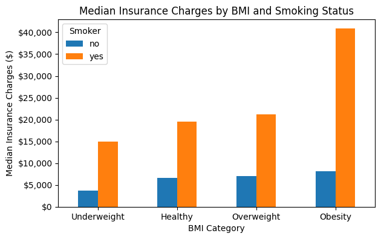

# U.S. Medical Insurance Cost Analysis

## Overview

This project analyzes U.S. medical insurance data to explore which factors are most strongly associated with higher insurance charges.

Using Python, Pandas, and Matplotlib, I examined how smoking status, BMI, age, and region relate to medical costs. I also looked at how these factors interact rather than analyzing each variable independently.

[View the full analysis](medical_insurance_analysis.ipynb)

## Tools

- Python
- Pandas
- Matplotlib
- Jupyter Notebook

## Dataset

The dataset contains demographic and insurance information including:

- Age
- Sex
- BMI
- Number of children
- Smoking status
- Region
- Medical insurance charges

The dataset was originally provided through Codecademy's U.S. Medical Insurance Costs portfolio project.

Before analysis, I checked the dataset for missing values, data types, and duplicate records. No missing values were found, and one duplicate record was removed, leaving 1,337 records for analysis.

## Highlight

## Analysis

The project focused on the following questions:

1. How are medical insurance charges distributed?
2. How strongly is smoking status associated with insurance charges?
3. Does the relationship between BMI and charges differ between smokers and non-smokers?
4. Does age relate to charges differently depending on smoking status?
5. Are regional cost differences influenced by differences in smoking rates?
6. What characteristics are most common among the highest-cost 10% of individuals?

## Key Findings

- Insurance charges were right-skewed, with a mean of $13,279.12 and a median of $9,386.16.

- Smoking status showed the clearest association with higher insurance charges. Smokers had mean charges ~279.7% higher and median charges ~369.1% higher than non-smokers.

- BMI had a very different relationship with charges depending on smoking status. Among smokers, BMI and charges had a strong positive correlation of 0.81, compared with only 0.08 among non-smokers.

- Age was associated with higher charges for both groups, but the relationship was stronger among non-smokers (r = 0.63) than smokers (r = 0.37). Despite this, smokers had median charges ~$30,000–$32,000 higher across all age groups analyzed.

- Regional differences were present, but smoking rates alone did not explain them. The Southeast had the highest smoking rate and was also overrepresented among high-cost individuals.

- The highest-cost 10% of individuals stood out significantly: ~97.8% were smokers and ~96.3% fell into the obesity BMI category.

Overall, smoking status stood out as the factor most clearly associated with higher insurance charges, especially when combined with higher BMI.

## Limitations

This dataset contains only 1,337 records after cleaning and includes a limited number of variables. Important factors such as medical history, diagnoses, healthcare usage, occupation, and insurance coverage are not included.

Some subgroups were also relatively small, including only 5 underweight smokers and 22 smokers in the 61+ age group.

The analysis identifies associations within the dataset and should not be interpreted as evidence that any individual factor directly causes higher insurance charges.

## Project Files

- `medical_insurance_analysis.ipynb` — Full Python analysis and visualizations
- `insurance.csv` — Dataset used for the analysis